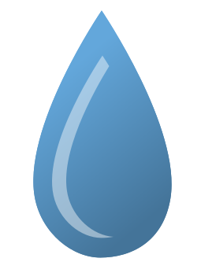

<div align="center">



# Energia Hídrica


Static website about hydropower, with an informative layout and visual elements to explain the topic clearly.

</div>

## Overview

The site presents basic concepts, benefits, and challenges of hydropower, focusing on quick reading, section-based organization, and visual support through illustrations.

## Contents

- Main page: [index.html](index.html)
- Styles: [css/estilos.css](css/estilos.css)
- Scripts:
  - [js/script_flip_card.js](js/script_flip_card.js)
  - [js/script_popup.js](js/script_popup.js)
  - [js/script_sec_activa_e_mobile.js](js/script_sec_activa_e_mobile.js)
- Images and illustrations: [images/](images/)
- Fonts: [fonts/](fonts/)

## Features

- Informational cards with flip effect
- Popups for additional details
- Active section highlighting and mobile behavior
- Responsive layout with clear reading hierarchy

## How to open

1. Open [index.html](index.html) in your browser.
2. Optional: use a local server to avoid resource loading restrictions in some browsers.

If needed, use a local server (for example, the Live Server extension in VS Code).

## How to edit

- Adjust styles in [css/estilos.css](css/estilos.css)
- Update text and structure in [index.html](index.html)
- Review interactions in [js/script_flip_card.js](js/script_flip_card.js), [js/script_popup.js](js/script_popup.js), and [js/script_sec_activa_e_mobile.js](js/script_sec_activa_e_mobile.js)
- Replace images in [images/](images/)

## Project structure

```
.
├── index.html
├── css/
│   └── estilos.css
├── js/
│   ├── script_flip_card.js
│   ├── script_popup.js
│   └── script_sec_activa_e_mobile.js
├── images/
│   ├── Ilustracoes/
│   ├── images_menu/
│   └── Logos/
└── fonts/
```
